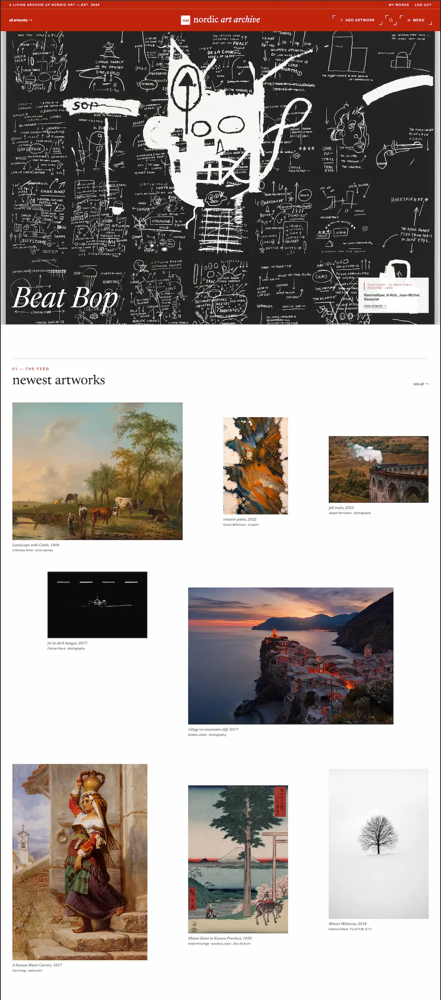
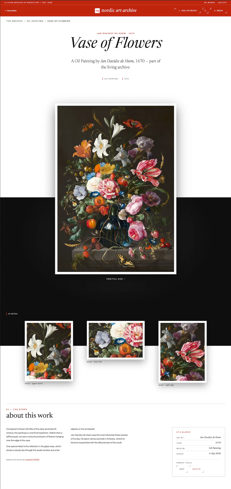

# Nordic Art Archive

[](https://github.com/sergiu-sa/nordic_art_exam_1/actions/workflows/ci.yml)

Front-end for an artworks-management web app, built for the Noroff FED1 Exam Project 1. Visitors browse and view a feed of artworks; registered owners log in to create, edit, and delete their own works. The design language, «Signal», treats the site as a
walk through a printed archive: white as the ground, serif titles in lowercase, one loud vermilion, and rooms that dim to ink the deeper you go.

**Live site:** https://nordicartarchive.netlify.app/





## Pages

- **The feed** (`index.html`) — home: the hero, the newest works, the dark room, and ways in by medium.
- **All artworks** (`collection.html`) — the full archive, with client-side search, medium filters, grid/index views, and load-more. Beyond the brief.
- **Artwork detail** (`artwork/index.html?id=…`) — title, artist, year, medium, description and image, plus related works and a prev/next walk.
- **The door** (`account/register.html`, `account/login.html`) — validated register and login forms for `stud.noroff.no` accounts.
- **The studio** (`artwork/create.html`, `artwork/edit.html`) — owners create, edit, and delete works beside a live preview wall. Logged-in only, behind a shared guard.
- **A collector's room** (`profile.html`) — everything one contributor keeps; your own room when logged in, any contributor's read-only via `?owner=`. Beyond the brief.

## Data & auth

All data comes from the [Noroff Artworks API v2](https://docs.noroff.dev/docs/v2/basic/artworks). Reads are public; writes send a Bearer token plus an API key, both created at login and held in `sessionStorage` for the life of the tab. Every fetch renders four explicit states: loading, success, empty, error.

## Tech stack

- **HTML, CSS, and vanilla JavaScript**: no framework or runtime library, and no build step. The deployed site is the static files in this repo, served as-is.
- Native ES modules with relative imports; modular CSS split by tokens, base, layout, components, and pages.
- Data from the **Noroff Artworks API**; hosted on **Netlify**.
- Dev only tooling (never shipped): ESLint, Prettier, EditorConfig, Vitest, Playwright, live-server.

## Tech & design decisions

- **No build step.** The brief mandates vanilla HTML/CSS/JS, so the repo takes it at its word: what's committed is exactly what Netlify serves.
- **Modular CSS without a bundler.** Styles split by tokens, base, layout, components, and pages; each page links only the files it uses, in cascade order. Many small files are cheap over HTTP/2, and no file grows unbounded.
- **`sessionStorage`, not `localStorage`.** The token and API key die with the tab. A fresh login per session is a fair price for not leaving credentials behind.
- **Ids travel in the query string.** The API wants the UUID in the path, but static pages have no dynamic routes, so detail and edit read `?id=<uuid>`.
- **Search and filters are client-side.** The API has no search endpoint; the collection filters the fetched pool in the browser and deep-links via `?medium=`.
- **Load-more, not numbered pagination.** It keeps the browsing flow and stays coherent when client-side filters shrink the list.
- **A defensive feed.** The shared API pool holds junk records and has thrown 500s on sorted requests, so the feed walks small unsorted pages, sorts client-side, skips a page that fails, and screens out unusable works (dead images, placeholder titles).
- **Honest data.** `medium` is free text (typos included), descriptions run from one word to whole walls, and there is no relations data. So mediums print raw, the detail layout switches on description length, and related works follow a stated heuristic (same artist, then same medium, then nearest year) rather than pretending the API knows more than it does.
- **Motion is scroll-coupled and skippable.** Backgrounds and ink effects scrub with the scroll instead of firing on triggers, and everything sits behind `prefers-reduced-motion`.
- **The ink stains are live text.** The over-printed titles are SVG filters on real text: the crisp line is the actual heading, the echoes are `aria-hidden`, and only opacities animate. Screen readers, find-in-page, and text selection are untouched.

## Getting started

Requires **Node 22+** (see `.nvmrc`). The tooling is for local development only, the site itself needs no build.

```bash
npm install      # install dev dependencies
npm run dev      # serve locally at http://localhost:8080
```

### Scripts

| Script                 | What it does                            |
| ---------------------- | --------------------------------------- |
| `npm run dev`          | Serve the site locally with live reload |
| `npm run lint`         | Lint the JavaScript with ESLint         |
| `npm run format`       | Format the codebase with Prettier       |
| `npm run format:check` | Check formatting without writing        |
| `npm test`             | Run unit tests (Vitest)                 |
| `npm run test:e2e`     | Run the smoke test (Playwright)         |

## Structure

```md
index.html # artworks feed (home)
collection.html # all artworks: search, filters, grid/index views
profile.html # a collector's room, keyed on ?owner=
artwork/ # detail, create, edit
account/ # login, register
css/ # modular styles: tokens · base · layout · components · pages
js/ # vanilla ES modules (shared helpers + per-page logic)
assets/ # brand SVGs, favicons, images
tests/ # unit (Vitest) · e2e (Playwright)
```

Pages link only the CSS they need, in cascade order (`tokens → base → layout → components → page`). Built mobile-first, to a WCAG 2.1 AA baseline.

## Quality

- Every user story manually tested on the deployed site, at mobile and desktop widths.
- 313 unit tests over the pure modules (validation, formatting, data shaping, the API helper), plus a Playwright smoke test. The brief asks for manual testing only; the automated suite goes beyond it.
- Every page passes the W3C HTML and CSS validators; Lighthouse accessibility is 100.
- Keyboard-complete flows, visible focus everywhere, `prefers-reduced-motion` honoured.
- Hash-based Content Security Policy and security headers via `netlify.toml`.

## Design & planning

Designed in Figma from the «Signal» style guide: Newsreader and Archivo, a five-colour token palette, corner-tick buttons, numbered chapters.

- [Figma style guide & designs](https://www.figma.com/design/DegzvhrZxsUTlXLyTCM3iD/nordic-art-archive)
- [Project board — backlog](https://github.com/users/sergiu-sa/projects/15/views/1) ·
  [roadmap](https://github.com/users/sergiu-sa/projects/15/views/4)

## Credits

- Icons: [Heroicons](https://heroicons.com) outline (MIT), inlined per page.
- The login/register pages' no-JS fallback imagery: public-domain Nordic works via Wikimedia Commons. Everything else on the site comes from the artworks API.

## Author

**Sergiu Sarbu** — [github.com/sergiu-sa](https://github.com/sergiu-sa)

Built as an exam submission for Noroff's front-end development programme.

## License

The code is released under the [MIT License](LICENSE). The artworks shown are not mine to license: they reach the site through the shared Noroff Artworks API and belong to their respective owners.
